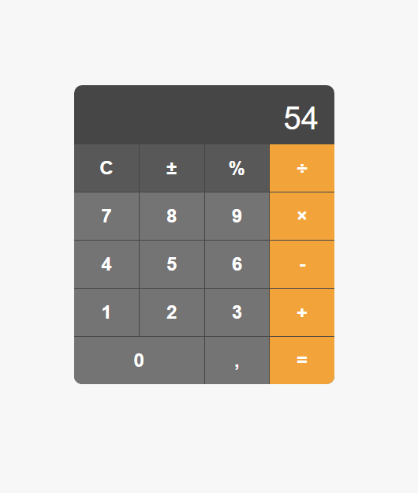

## Calculadora Simples

Este é um projeto de uma calculadora simples desenvolvida utilizando HTML, CSS e JavaScript.

### Funcionalidades

- Adição
- Subtração
- Multiplicação
- Divisão

### Como Usar

1. Faça o download ou clone este repositório.
2. Abra o arquivo `index.html` em seu navegador web.
3. Utilize a interface da calculadora para realizar cálculos básicos.

### Imagem do Projeto

### Contribuindo

Contribuições são bem-vindas! Se você tiver sugestões para melhorar este projeto, sinta-se à vontade para enviar um pull request.

